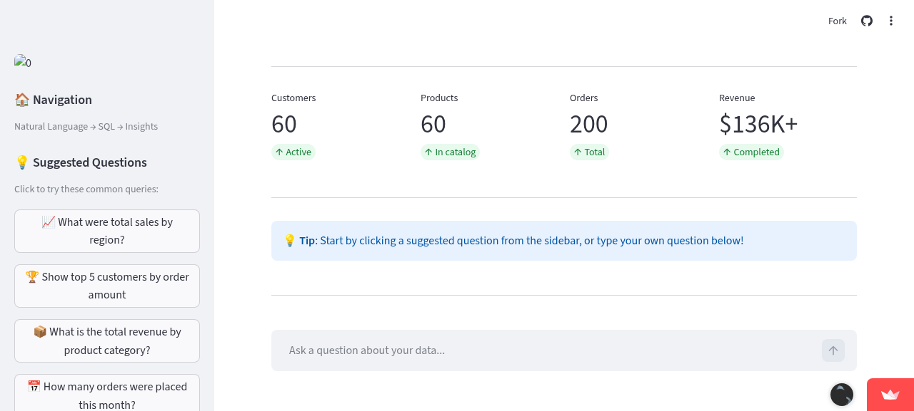
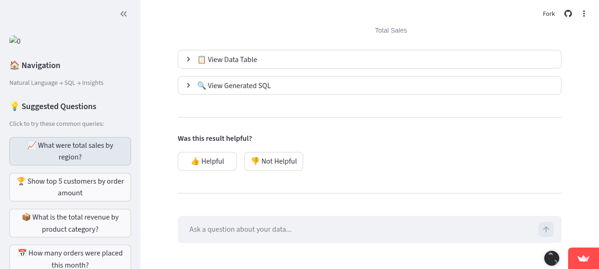
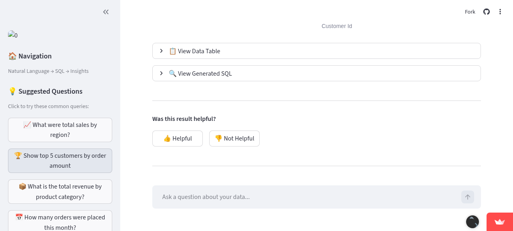

# NL-BI Dashboard

## Natural Language Business Intelligence Dashboard

**An AI-powered analytics tool that allows non-technical users to query business data using natural language.**

The NL-BI Dashboard bridges the gap between business users and database insights by translating natural language questions into secure SQL queries, executing them against a read-only database, and automatically visualizing the results with intelligent chart selection.

---

## Table of Contents

- [Overview](#overview)
- [Tech Stack](#tech-stack)
- [Features](#features)
- [Quick Start](#quick-start)
- [Installation](#installation)
- [Usage Guide](#usage-guide)
- [Security Features](#security-features)
- [API Reference](#api-reference)
- [Testing](#testing)
- [Future Roadmap](#future-roadmap)
- [PostgreSQL Migration Guide](#postgresql-migration-guide)
- [Troubleshooting](#troubleshooting)
- [License](#license)

---

## Overview

The NL-BI Dashboard translates natural language questions into secure SQL queries, executes them against a read-only database, and automatically visualizes the results. Built following the PRD specifications for the MVP phase.

### Architecture

```
┌─────────────────┐    ┌─────────────────┐    ┌─────────────────┐    ┌─────────────────┐
│   User Question │───▶│  LangChain SQL  │───▶│    Security     │───▶│    Database     │
│  (Natural Lang) │    │     Chain       │    │   Validation    │    │    (SQLite)     │
└─────────────────┘    └─────────────────┘    └─────────────────┘    └─────────────────┘
                                                        │
                                                        ▼
                                              ┌─────────────────┐
                                              │   Visualization │
                                              │   (Plotly)      │
                                              └─────────────────┘
```

### Key Capabilities

- **Natural Language Interface**: Ask questions in plain English - no SQL knowledge required
- **Multi-Provider LLM Support**: Works with OpenAI, Ollama, Groq, Together AI, or any OpenAI-compatible endpoint
- **Defense-in-Depth Security**: 5 layers of SQL injection prevention
- **Intelligent Visualization**: Automatic chart type selection based on data analysis
- **Transparent SQL**: View the generated SQL for verification and learning
- **Feedback System**: Thumbs up/down to help improve accuracy
- **Few-Shot Prompting**: Dynamic example selection for complex SQL patterns (CTEs, window functions)
- **Query History**: Persistent history with sidebar access to recent queries
- **AI-Powered Insights**: One-click data analysis with natural language explanations
- **Semantic Caching**: Intelligent query caching for faster responses and reduced API costs

---

## Tech Stack

| Component | Technology | Purpose |
|-----------|------------|---------|
| **Frontend** | Streamlit | Interactive web UI with chat interface |
| **LLM Framework** | LangChain | SQL generation chain with retry logic |
| **Database** | SQLite (MVP) | E-commerce sample data with 4 tables |
| **Visualization** | Plotly Express | Auto-chart generation (Bar, Line, Pie, KPI, Scatter) |
| **Security** | sqlparse + regex | SQL validation and injection prevention |
| **Validation** | Pydantic | Data models and configuration |
| **Caching** | Semantic Cache | Hash-based query result caching |
| **Embeddings** | sentence-transformers | Semantic similarity for few-shot selection |

### Dependencies

```
langchain>=1.2.0
langchain-openai>=1.1.0
langchain-community>=0.4.0
streamlit>=1.28.0
plotly>=5.18.0
pandas>=2.0.0
sqlparse>=0.5.0
sqlalchemy>=2.0.0
pydantic>=2.0.0
python-dotenv>=1.0.0
sentence-transformers>=2.2.0
```

---

## Features

### Natural Language Query Interface

Type questions in plain English:
- *"What were total sales by region?"*
- *"Show me the top 5 customers by order amount"*
- *"How many orders were placed this month?"*
- *"What is the revenue trend over time?"*

### Automatic Visualization

The system intelligently selects the best chart type based on your data:

| Data Pattern | Chart Type | Example |
|--------------|------------|---------|
| Single aggregate value | KPI Card | Total revenue: $136,897 |
| Time series | Line Chart | Sales trend over months |
| Categorical comparison | Bar Chart | Revenue by region |
| Distribution | Pie Chart | Order status breakdown |
| Two numeric columns | Scatter Plot | Price vs quantity correlation |
| Complex data | Table View | Full data table with sorting |

### Supported LLM Providers

| Provider | Type | Endpoint | Use Case |
|----------|------|----------|----------|
| **OpenAI** | Cloud | Default | Production, highest accuracy |
| **Ollama** | Local | `http://localhost:11434/v1` | Free, private, offline |
| **LM Studio** | Local | `http://localhost:1234/v1` | GUI-based local LLM |
| **vLLM** | Local | `http://localhost:8000/v1` | High-performance serving |
| **Groq** | Cloud | `https://api.groq.com/openai/v1` | Ultra-fast inference |
| **Together AI** | Cloud | `https://api.together.xyz/v1` | Open-source models |
| **Azure OpenAI** | Cloud | Your Azure endpoint | Enterprise integration |

---

## Quick Start

### Prerequisites

- Python 3.10 or higher
- pip (Python package manager)
- An LLM API key (OpenAI, Groq, etc.) OR a local LLM (Ollama, LM Studio)

### 1. Clone and Setup

```bash
# Clone the repository
git clone https://github.com/insydr/nl-bi-dashboard.git
cd nl-bi-dashboard

# Create virtual environment
python3 -m venv venv
source venv/bin/activate  # On Windows: venv\Scripts\activate

# Install dependencies
pip install -r requirements.txt
```

### 2. Initialize Database

```bash
python database_setup.py
```

This creates the SQLite database with sample e-commerce data:
- 60 customers across 5 regions
- 60 products in 7 categories
- 200 orders over ~15 months
- 547 order items

### 3. Configure LLM Provider

```bash
# Copy the example environment file
cp .env.example .env

# Edit .env with your preferred configuration
# For OpenAI:
#   OPENAI_API_KEY=sk-your-key-here

# For Ollama (local):
#   LLM_API_KEY=ollama
#   LLM_BASE_URL=http://localhost:11434/v1
#   LLM_MODEL=llama3
```

### 4. Run the Dashboard

```bash
streamlit run app.py
```

The dashboard will open at **http://localhost:8501**

---

## Installation

### Detailed Installation Guide

#### Step 1: System Requirements

| Requirement | Minimum | Recommended |
|-------------|---------|-------------|
| Python | 3.10 | 3.11+ |
| RAM | 4 GB | 8 GB+ |
| Disk | 500 MB | 1 GB |
| OS | Linux/macOS/Windows | Linux/macOS |

#### Step 2: Virtual Environment Setup

```bash
# Create virtual environment
python3 -m venv venv

# Activate (Linux/macOS)
source venv/bin/activate

# Activate (Windows)
venv\Scripts\activate

# Verify activation
which python  # Should show venv path
```

#### Step 3: Install Dependencies

```bash
# Install all dependencies
pip install -r requirements.txt

# Verify installation
python -c "import streamlit; import langchain; import plotly; print('All dependencies installed!')"
```

#### Step 4: Database Setup

```bash
# Initialize database with sample data
python database_setup.py

# Verify database
ls -la data/ecommerce.db
```

#### Step 5: LLM Configuration

**Option A: OpenAI (Recommended for accuracy)**

```bash
# Set environment variable
export OPENAI_API_KEY="sk-your-key-here"

# Or add to .env file
echo "OPENAI_API_KEY=sk-your-key-here" >> .env
```

**Option B: Ollama (Recommended for privacy)**

```bash
# Install Ollama (see https://ollama.ai)
curl -fsSL https://ollama.ai/install.sh | sh

# Pull a model
ollama pull llama3

# Configure environment
export LLM_API_KEY="ollama"
export LLM_BASE_URL="http://localhost:11434/v1"
export LLM_MODEL="llama3"
```

**Option C: Groq (Recommended for speed)**

```bash
# Get API key from https://console.groq.com
export LLM_API_KEY="gsk_your-key-here"
export LLM_BASE_URL="https://api.groq.com/openai/v1"
export LLM_MODEL="llama-3.1-70b-versatile"
```

---

## Usage Guide

### Starting the Dashboard

```bash
# Basic start
streamlit run app.py

# Run on specific port
streamlit run app.py --server.port 8502

# Run in headless mode (for servers)
streamlit run app.py --server.headless true
```

### Querying Data

#### Basic Queries

Simply type your question in the chat input:

```
What is the total revenue?
```

The system will:
1. Generate SQL: `SELECT SUM(total_amount) as total_revenue FROM orders WHERE status = 'completed'`
2. Validate the query for security
3. Execute against the read-only database
4. Display results as a KPI card

#### Complex Queries

```
Show me the top 5 customers by total order amount
```

Results in a bar chart with customer names and their spending.

#### Time Series Queries

```
What is the monthly revenue trend?
```

Results in a line chart with date axis and trend line.

### Using Suggested Questions

The sidebar provides quick-access suggested questions:
- 📈 What were total sales by region?
- 🏆 Show top 5 customers by order amount
- 📦 What is the total revenue by product category?
- 📅 How many orders were placed this month?
- 💰 What is the average order value?

### Viewing SQL

Click "🔍 View Generated SQL" to see the exact SQL query generated by the LLM. This is useful for:
- Learning SQL syntax
- Verifying query logic
- Debugging unexpected results

### Exporting Data

Use the "📥 Download as CSV" button to export query results.

### Providing Feedback

Use the thumbs up/down buttons to rate query results. This helps improve the system over time.

---

## Screenshots

### Main Dashboard



*The Welcome screen with Suggested questions for *   Sidebar navigation
*   Query history tracking

### Query Results - Bar Chart



*   Natural language query converted to SQL
*   Interactive Plotly visualization
*   Download as CSV option
*   View generated SQL

### Query Results - Top Customers



*   Horizontal bar chart
*   Data table toggle
*   Feedback buttons

---

## Security Features

### Defense-in-Depth Architecture

The NL-BI Dashboard implements 5 layers of security validation to prevent SQL injection and ensure data safety:

```
┌─────────────────────────────────────────────────────────────────────────┐
│                        SECURITY VALIDATION PIPELINE                      │
├─────────────────────────────────────────────────────────────────────────┤
│ Layer 1: Input Sanitization                                              │
│   - Prompt injection detection                                           │
│   - Character validation                                                 │
│   - Length limits (5-500 chars)                                          │
├─────────────────────────────────────────────────────────────────────────┤
│ Layer 2: SQL Parser Validation                                           │
│   - sqlparse library validation                                          │
│   - Statement type extraction                                            │
│   - Multiple statement detection                                         │
├─────────────────────────────────────────────────────────────────────────┤
│ Layer 3: Keyword Blocklist                                               │
│   - DROP, DELETE, UPDATE, INSERT                                         │
│   - ALTER, CREATE, TRUNCATE, GRANT                                       │
│   - EXEC, EXECUTE, MERGE, CALL                                           │
├─────────────────────────────────────────────────────────────────────────┤
│ Layer 4: Injection Pattern Detection                                     │
│   - SQL comments (-- and /*)                                             │
│   - UNION with system tables                                             │
│   - Hex-encoded strings                                                  │
│   - Time-based injection patterns                                        │
├─────────────────────────────────────────────────────────────────────────┤
│ Layer 5: Schema Allow-List                                               │
│   - Only permitted tables: customers, products, orders, order_items      │
│   - Foreign key validation                                               │
│   - Column existence check                                               │
└─────────────────────────────────────────────────────────────────────────┘
```

### SQL Injection Prevention

| Attack Vector | Mitigation | Example |
|---------------|------------|---------|
| Multiple statements | Blocked at parser level | `SELECT *; DROP TABLE--` |
| Comment injection | Pattern detection | `WHERE id = 1 -- comment` |
| UNION injection | System table access blocked | `UNION SELECT * FROM sqlite_master` |
| Keyword injection | Blocklist enforcement | `DROP TABLE customers` |
| Schema violations | Allow-list validation | `SELECT * FROM secret_table` |
| Prompt injection | Input sanitization | `Ignore previous instructions...` |

### Read-Only Enforcement

```python
# SQLite read-only connection via URI
conn = sqlite3.connect(f"file:{db_file}?mode=ro", uri=True)
```

Even if all other security layers fail, the database connection is strictly read-only, preventing any data modification.

### Row Limit Protection

All queries are automatically limited to **5000 rows maximum** to prevent:
- Memory overload attacks
- Full table dumps
- Performance degradation

The system automatically injects `LIMIT 5000` to all SELECT queries, overriding any user-specified limit that exceeds this threshold.

### Rate Limiting

- **Limit**: 30 queries per 5 minutes (configurable)
- **Purpose**: Prevent abuse and API cost overruns
- **Implementation**: Sliding window algorithm

### Error Message Sanitization

Error messages are sanitized to prevent information leakage:
- Database paths are masked
- API keys are hidden
- Internal details are replaced with generic messages

---

## API Reference

### Core Functions

#### `run_query(user_question, **options)`

Execute a natural language query against the database.

```python
from sql_chain import run_query, LLMConfig

# Basic usage
result = run_query("What were total sales by region?")

# With custom LLM config
config = LLMConfig(
    api_key="your-key",
    base_url="http://localhost:11434/v1",
    model="llama3"
)
result = run_query("Total revenue?", config=config)

# With predefined provider
result = run_query("Top customers?", provider="ollama")

# Check result
if result.success:
    print(f"SQL: {result.sql_query}")
    print(f"Rows: {len(result.dataframe)}")
    print(result.dataframe.head())
else:
    print(f"Error: {result.error_message}")
```

**Parameters:**

| Parameter | Type | Description |
|-----------|------|-------------|
| `user_question` | str | Natural language question |
| `llm` | BaseChatModel | Pre-configured LLM instance |
| `api_key` | str | API key override |
| `base_url` | str | Custom endpoint URL |
| `model` | str | Model name (default: gpt-4o) |
| `config` | LLMConfig | Full configuration object |
| `provider` | str | Predefined provider name |
| `user_id` | str | User ID for rate limiting |

**Returns:** `QueryResult` dataclass

```python
@dataclass
class QueryResult:
    success: bool
    sql_query: Optional[str]
    dataframe: Optional[pd.DataFrame]
    error_message: Optional[str]
    retry_count: int
    validation_details: Optional[SQLValidationResult]
```

#### `generate_chart(df, query, chart_type, title)`

Generate an appropriate chart from a DataFrame.

```python
from visualization import generate_chart, ChartType

# Auto-detect chart type
fig = generate_chart(df, "Sales by region")

# Force specific chart type
fig = generate_chart(df, chart_type=ChartType.BAR)

# Display in Streamlit
st.plotly_chart(fig, use_container_width=True)

# Save as HTML
fig.write_html("chart.html")

# Save as image (requires kaleido)
fig.write_image("chart.png")
```

#### `LLMConfig`

Configuration for LLM settings.

```python
from sql_chain import LLMConfig

# From environment
config = LLMConfig.from_env()

# Custom configuration
config = LLMConfig(
    api_key="your-key",
    base_url="http://localhost:11434/v1",
    model="llama3",
    temperature=0.0,
    max_tokens=2000
)

# Validate
is_valid, error = config.validate()
```

#### `generate_data_insights(df, question)`

Generate AI-powered natural language insights from query results.

```python
from sql_chain import generate_data_insights

# Generate insights from a DataFrame
df = result.dataframe  # From a query result
insights = generate_data_insights(df, "What were total sales by region?")

print(insights)
# Output:
# 📊 Data Insights:
# 1. Top Region: West leads with $38,245 in revenue (27.9% of total)
# 2. Growth Trend: Revenue increased 15% compared to the previous period
# ...
```

**Parameters:**

| Parameter | Type | Description |
|-----------|------|-------------|
| `df` | pd.DataFrame | The query result data |
| `question` | str | The original user question for context |

**Returns:** `str` - Natural language insights about the data

#### `SemanticCache`

Manage the query result cache.

```python
from sql_chain import SemanticCache

# Initialize cache
cache = SemanticCache()

# Check cache
key = cache.get_cache_key("What is total revenue?")
cached = cache.get(key)

if cached:
    print("Cache hit!")
    result = cached
else:
    # Run query and store result
    result = run_query("What is total revenue?")
    cache.set(key, result)

# Clear cache
cache.clear()
```

### Security Functions

```python
from security import (
    sanitize_user_input,
    enforce_row_limit,
    check_rate_limit,
    perform_security_check
)

# Sanitize user input
result = sanitize_user_input("What is revenue?")
if result.is_safe:
    clean_input = result.sanitized_input

# Enforce row limit on SQL
safe_sql = enforce_row_limit("SELECT * FROM orders")

# Check rate limit
rate = check_rate_limit("user_123")
if rate.is_allowed:
    # Proceed with query
    pass

# Comprehensive security check
is_safe, issues = perform_security_check(
    user_question="What is revenue?",
    sql_query="SELECT * FROM orders",
    user_id="user_123"
)
```

---

## Testing

### Run All Tests

```bash
# Run complete test suite
pytest test_queries.py -v

# Run with coverage
pytest test_queries.py -v --cov=. --cov-report=html
```

### Test Categories

| Category | Description | Count |
|----------|-------------|-------|
| Golden Queries | Expected to succeed | 5 |
| Adversarial Queries | Expected to be blocked | 6 |
| SQL Validation | Validation layer tests | 17 |
| Input Sanitization | User input handling | 8 |
| Rate Limiting | Rate limit enforcement | 4 |
| Error Messages | Information leakage prevention | 3 |
| Database Security | Read-only enforcement | 2 |
| Integration | Full pipeline tests | 3 |

### Golden Query Tests

```bash
# Run only golden queries
pytest test_queries.py::TestGoldenQueries -v
```

### Adversarial Query Tests

```bash
# Run only adversarial queries
pytest test_queries.py::TestAdversarialQueries -v
```

### Module Tests

```bash
# Test SQL chain
python sql_chain.py

# Test visualization
python visualization.py

# Test security
python security.py

# Test database setup
python database_setup.py
```

---

## Future Roadmap

### Phase 1: MVP ✅

- [x] Database setup with sample e-commerce data
- [x] 5-layer security validation
- [x] LangChain SQL chain with retry mechanism
- [x] OpenAI-compatible endpoint support
- [x] Streamlit UI with chat interface
- [x] Plotly auto-visualization
- [x] Input sanitization
- [x] Rate limiting
- [x] Row limit enforcement
- [x] Comprehensive test suite

### Phase 2: Enhancements ✅

Per PRD Section 10, Phase 2 deliverables:

- [x] **Switch to PostgreSQL** - Full PostgreSQL support with Docker Compose setup
- [x] **Few-Shot Prompting** - Implement few-shot prompting for higher accuracy
- [x] **"Explain this Chart"** - LLM analyzes the result data
- [x] **Query History sidebar** - Persistent query history

#### PostgreSQL Setup

The system supports both SQLite (MVP) and PostgreSQL (Production). To switch to PostgreSQL:

**1. Start PostgreSQL with Docker:**

```bash
# Start PostgreSQL container
docker-compose up -d postgres

# Verify container is running
docker-compose ps
```

**2. Initialize the database:**

```bash
# Set environment variables for PostgreSQL
export DB_TYPE=postgresql
export DB_HOST=localhost
export DB_PORT=5432
export DB_NAME=nlbi_dashboard
export DB_ADMIN_USER=admin
export DB_ADMIN_PASSWORD=admin_secret_2024

# Initialize database with sample data
python database_setup.py
```

**3. Configure the application:**

```bash
# Update .env file
echo "DB_TYPE=postgresql" >> .env
echo "DB_HOST=localhost" >> .env
echo "DB_USER=nlbi_readonly" >> .env
echo "DB_PASSWORD=nlbi_readonly_secret_2024" >> .env

# Run the dashboard
streamlit run app.py
```

**Docker Services:**

| Service | Port | Purpose |
|---------|------|--------|
| PostgreSQL | 5432 | Database server |
| pgAdmin 4 | 5050 | Web-based DB management (optional) |

**Start pgAdmin (optional):**

```bash
docker-compose --profile admin up -d
# Access pgAdmin at http://localhost:5050
```

#### Additional Enhancements Implemented

The following enhancements were implemented beyond the PRD requirements:

- [x] **CTE (Common Table Expression) support** in SQL validation
- [x] **Semantic caching** for query results (hash-based)
- [x] **Streamlit caching decorators** for performance optimization
- [x] **Hard LIMIT 5000** row protection
- [x] **Performance benchmarking script**

#### Few-Shot Prompting Feature

The NL-BI Dashboard now uses **few-shot prompting** to guide the LLM in generating correct SQL for complex queries. This significantly improves accuracy for queries involving:

- **Window functions** (LAG, LEAD, ROW_NUMBER)
- **Common Table Expressions (CTEs)**
- **Complex JOINs** with aggregations
- **Month-over-month comparisons**
- **Customer retention analysis**

**How it works:**

1. The system maintains a curated repository of 10 example queries covering various SQL patterns
2. For each user question, the most relevant 2-3 examples are dynamically selected based on semantic similarity
3. These examples are included in the LLM prompt to guide SQL generation
4. Result: More accurate SQL, fewer retries, better handling of complex queries

**Configuration:**

```bash
# Enable/disable dynamic example selection (default: true)
ENABLE_DYNAMIC_EXAMPLES=true

# Number of examples per prompt (default: 3)
NUM_FEW_SHOT_EXAMPLES=3

# Minimum similarity threshold for selection (default: 0.3)
MIN_EXAMPLE_SIMILARITY=0.3
```

**Example queries now handled correctly:**

| Complex Query | Technique Used |
|---------------|----------------|
| "Show month-over-month revenue growth" | LAG() window function with CTE |
| "Customer retention by signup month" | LEFT JOIN + CASE WHEN + CTE |
| "Products with low stock and high sales" | HAVING clause + COALESCE |
| "Average order value by segment" | Multiple aggregations + ROUND |

#### Query History & Insights

**Query History Persistence:**

- All queries are automatically logged to the `query_logs` table in SQLite
- Sidebar displays the last 10 queries for quick re-execution
- Each entry shows the question, timestamp, and success status
- Click on any history item to re-run the query

**AI-Powered Data Insights:**

- Click the "💡 Insights" button after any query to get AI-generated analysis
- The system analyzes your data and provides natural language explanations
- Insights include trends, anomalies, top performers, and recommendations
- Great for users who want deeper understanding of their data

**Example Insight Output:**

```
📊 Data Insights:

1. Top Region: West leads with $38,245 in revenue (27.9% of total)
2. Growth Trend: Revenue increased 15% compared to the previous period
3. Anomaly Detected: North region shows unusually low average order value
4. Recommendation: Consider investigating the North region's pricing strategy
```

#### Performance Optimization & Caching

**Semantic Caching:**

The system implements intelligent query caching to reduce API costs and improve response times:

- **Hash-based caching**: Questions are normalized and hashed for cache lookup
- **Cache hit**: Previously asked questions return cached results instantly (< 100ms)
- **Cache miss**: New questions go through the full LLM pipeline
- **Cache key normalization**: Handles case, whitespace, and punctuation variations

**Streamlit Caching:**

Two types of caching decorators optimize the UI:

| Decorator | Used For | Benefit |
|-----------|----------|--------|
| `@st.cache_resource` | LLM chain initialization | Singleton pattern, avoids re-creation |
| `@st.cache_data` | Database connections, schema retrieval | Memoization with TTL support |

**Row Limiting:**

- Hard limit of **5000 rows** on all queries
- Automatic `LIMIT 5000` injection if no limit specified
- User-specified limits above 5000 are capped
- Protects against memory issues and performance degradation

**Performance Benchmarks:**

| Scenario | Response Time | API Calls |
|----------|---------------|----------|
| First query (cold cache) | 2-5 seconds | 1 LLM call |
| Repeated query (cache hit) | < 100ms | 0 LLM calls |
| Similar query (few-shot) | 2-4 seconds | 1 LLM call |
| Data insights generation | 3-6 seconds | 1 LLM call |

Run the benchmark script:

```bash
python benchmark_caching.py
```

**Caching Configuration:**

```bash
# Enable/disable caching (default: true)
ENABLE_CACHING=true

# Cache TTL in seconds (default: 3600 = 1 hour)
CACHE_TTL_SECONDS=3600
```

### Phase 3: Production (Weeks 9+)

Per PRD Section 10, Phase 3 deliverables:

- [ ] **React Frontend** for better customization
- [ ] **Caching layer (Redis)** for common queries
- [ ] **Fine-tuning** a smaller model on successful query logs
- [ ] **Role-Based Access Control (RBAC)** for data tables

### Future Enhancements (Beyond PRD)

The following items are potential future enhancements not defined in the PRD:

- [ ] Custom schema support for user databases
- [ ] Query templates for common business questions
- [ ] Export to Excel with formatting
- [ ] WebSocket support for real-time updates
- [ ] Multi-tenant support

---

## PostgreSQL Migration Guide

Per PRD Section 10, the following changes are needed to move from SQLite MVP to PostgreSQL Production:

#### Database Migration

| Component | SQLite (MVP) | PostgreSQL (Production) |
|-----------|--------------|-------------------------|
| **Connection** | File-based | Server-based with connection pooling |
| **Authentication** | None | Dedicated read-only user |
| **Permissions** | URI mode=ro | GRANT SELECT ON ALL TABLES |
| **SSL** | N/A | Required for data in transit |
| **Backup** | File copy | pg_dump, streaming replication |
| **Performance** | Single file | Connection pooling (PgBouncer) |
| **Scaling** | Limited | Read replicas, partitioning |

#### Required Changes

**1. Database Connection:**

```python
# SQLite (MVP)
conn = sqlite3.connect(f"file:{db_file}?mode=ro", uri=True)

# PostgreSQL (Production)
import psycopg2
conn = psycopg2.connect(
    host="db.example.com",
    database="analytics",
    user="readonly_user",  # Dedicated read-only user
    password=os.environ["DB_PASSWORD"],
    sslmode="require"  # Enforce SSL
)
```

**2. Security Hardening:**

```sql
-- Create dedicated read-only user
CREATE USER nlbi_readonly WITH PASSWORD 'secure_password';

-- Grant only SELECT permissions
GRANT CONNECT ON DATABASE analytics TO nlbi_readonly;
GRANT USAGE ON SCHEMA public TO nlbi_readonly;
GRANT SELECT ON ALL TABLES IN SCHEMA public TO nlbi_readonly;

-- Ensure future tables also get SELECT permission
ALTER DEFAULT PRIVILEGES IN SCHEMA public GRANT SELECT ON TABLES TO nlbi_readonly;
```

**3. SQL Dialect Changes:**

| Feature | SQLite | PostgreSQL |
|---------|--------|------------|
| Date functions | `date()`, `strftime()` | `DATE_TRUNC()`, `TO_CHAR()` |
| Boolean | 0/1 | TRUE/FALSE |
| String concat | `||` | `||` or `CONCAT()` |
| Auto-increment | `INTEGER PRIMARY KEY` | `SERIAL` or `IDENTITY` |
| JSON | Limited | Native `JSONB` |

**4. LLM Prompt Updates:**

Update `SQL_SYSTEM_PROMPT` to specify PostgreSQL dialect:
```
DATABASE-SPECIFIC NOTES:
- This is PostgreSQL, not SQLite
- Date functions: Use DATE_TRUNC(), TO_CHAR(), EXTRACT()
- Boolean values: Use TRUE/FALSE
- Use proper PostgreSQL syntax for all operations
```

**5. Infrastructure Requirements:**

| Component | Recommendation |
|-----------|----------------|
| Database | PostgreSQL 15+ with connection pooling |
| Caching | Redis for query results |
| Monitoring | Prometheus + Grafana |
| Logging | ELK Stack or Datadog |
| Secrets | HashiCorp Vault or AWS Secrets Manager |
| Load Balancer | Nginx or HAProxy |
| Container | Docker + Kubernetes |

**6. Security Checklist for Production:**

- [ ] Enable SSL/TLS for all connections
- [ ] Use connection pooling (PgBouncer)
- [ ] Implement proper secret management
- [ ] Set up audit logging
- [ ] Configure firewall rules
- [ ] Enable row-level security (RLS)
- [ ] Implement proper RBAC
- [ ] Set up monitoring and alerting

### Phase 4: Enterprise Features

- [ ] React/Next.js frontend
- [ ] Multi-tenant support
- [ ] Role-based access control (RBAC)
- [ ] Audit logging
- [ ] Model fine-tuning for domain-specific queries
- [ ] A/B testing for prompt engineering
- [ ] Real-time dashboard updates with WebSockets

---

## Troubleshooting

### "LLM Not Configured" Error

**Cause:** No API key is set.

**Solution:**
```bash
# For OpenAI
export OPENAI_API_KEY="sk-your-key-here"

# For custom endpoint
export LLM_API_KEY="your-key"
export LLM_BASE_URL="http://localhost:11434/v1"
export LLM_MODEL="llama3"

# Or create .env file
cp .env.example .env
# Edit .env with your keys
```

### "Database not found" Error

**Cause:** Database file doesn't exist.

**Solution:**
```bash
python database_setup.py
```

### "Query Failed" with SQL Error

**Cause:** The LLM generated invalid SQL.

**Solutions:**
1. Check the generated SQL in "View Generated SQL"
2. Try rephrasing your question
3. Use suggested questions as examples
4. Try a different LLM model (GPT-4 recommended for best accuracy)

### Slow Response Time

**Cause:** Large model or slow API.

**Solutions:**
1. For local LLMs: Use a smaller model (e.g., `llama3:8b`)
2. For cloud: Check your API rate limits
3. Consider using Groq for faster inference

### Rate Limit Exceeded

**Cause:** Too many queries in a short time.

**Solution:** Wait 5 minutes for the rate limit window to reset, or adjust `RATE_LIMIT_MAX_QUERIES` in `security.py`.

### "Read-only database" Error on Write Attempt

**This is expected behavior!** The database connection is intentionally read-only for security. All write operations will fail.

---

## Database Schema

### Tables

```sql
-- Customers (60 rows)
CREATE TABLE customers (
    id INTEGER PRIMARY KEY,
    name TEXT NOT NULL,
    email TEXT NOT NULL UNIQUE,
    signup_date DATE NOT NULL,
    region TEXT NOT NULL,
    customer_segment TEXT NOT NULL
);

-- Products (60 rows)
CREATE TABLE products (
    id INTEGER PRIMARY KEY,
    name TEXT NOT NULL,
    category TEXT NOT NULL,
    price REAL NOT NULL CHECK(price >= 0),
    stock_quantity INTEGER NOT NULL DEFAULT 0,
    supplier TEXT NOT NULL
);

-- Orders (200 rows)
CREATE TABLE orders (
    id INTEGER PRIMARY KEY,
    customer_id INTEGER NOT NULL,
    order_date DATE NOT NULL,
    total_amount REAL NOT NULL,
    status TEXT NOT NULL DEFAULT 'pending',
    shipping_method TEXT NOT NULL,
    FOREIGN KEY (customer_id) REFERENCES customers(id)
);

-- Order Items (547 rows)
CREATE TABLE order_items (
    id INTEGER PRIMARY KEY,
    order_id INTEGER NOT NULL,
    product_id INTEGER NOT NULL,
    quantity INTEGER NOT NULL CHECK(quantity > 0),
    unit_price REAL NOT NULL CHECK(unit_price >= 0),
    FOREIGN KEY (order_id) REFERENCES orders(id),
    FOREIGN KEY (product_id) REFERENCES products(id)
);
```

### Relationships

```
customers (1) ──────< (N) orders (1) ──────< (N) order_items (N) >────── (1) products
```

---

## Project Structure

```
nlbi-dashboard/
├── app.py                  # Streamlit frontend UI with caching decorators
├── sql_chain.py            # LangChain SQL chain with few-shot prompting & caching
├── query_examples.py       # Few-shot example repository (10 examples)
├── visualization.py        # Automatic chart generation engine
├── database_setup.py       # Database initialization, connection & query logging
├── security.py             # Security hardening module
├── test_queries.py         # Pytest test suite for security/validation
├── test_few_shot.py        # Few-shot prompting test suite
├── benchmark_caching.py    # Performance benchmark for cached vs uncached queries
├── data/
│   └── ecommerce.db        # SQLite database with sample e-commerce data
├── screenshots/            # Production screenshots for documentation
├── docker/                 # Docker configuration for PostgreSQL
├── requirements.txt        # Python dependencies with versions
├── .env.example            # Environment configuration template
├── .gitignore              # Git ignore patterns
└── README.md               # This file
```

---

## License

MIT License

Copyright (c) 2024 Sydr Dev

Permission is hereby granted, free of charge, to any person obtaining a copy
of this software and associated documentation files (the "Software"), to deal
in the Software without restriction, including without limitation the rights
to use, copy, modify, merge, publish, distribute, sublicense, and/or sell
copies of the Software, and to permit persons to whom the Software is
furnished to do so, subject to the following conditions:

The above copyright notice and this permission notice shall be included in all
copies or substantial portions of the Software.

THE SOFTWARE IS PROVIDED "AS IS", WITHOUT WARRANTY OF ANY KIND, EXPRESS OR
IMPLIED, INCLUDING BUT NOT LIMITED TO THE WARRANTIES OF MERCHANTABILITY,
FITNESS FOR A PARTICULAR PURPOSE AND NONINFRINGEMENT. IN NO EVENT SHALL THE
AUTHORS OR COPYRIGHT HOLDERS BE LIABLE FOR ANY CLAIM, DAMAGES OR OTHER
LIABILITY, WHETHER IN AN ACTION OF CONTRACT, TORT OR OTHERWISE, ARISING FROM,
OUT OF OR IN CONNECTION WITH THE SOFTWARE OR THE USE OR OTHER DEALINGS IN THE
SOFTWARE.

---

## Author

**Sydr Dev**
Email: rsd.iz.rosyid@gmail.com
GitHub: [insydr](https://github.com/insydr)

---

## Acknowledgments

- [LangChain](https://langchain.com) - SQL chain framework and LLM integration
- [Streamlit](https://streamlit.io) - Rapid UI development for data apps
- [Plotly](https://plotly.com) - Interactive visualization library
- [sqlparse](https://github.com/andialbrecht/sqlparse) - SQL parsing and validation
- [OpenAI](https://openai.com) - GPT models for natural language understanding
- [Ollama](https://ollama.ai) - Local LLM deployment made simple
